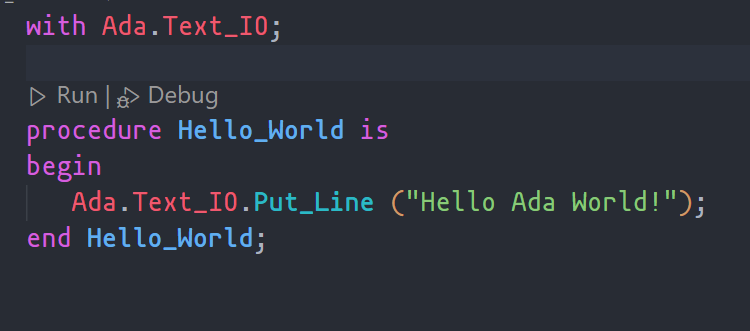

# HelloWorld en Ada

## Requisitos
- WSL o entorno linux
- Visual Studio Code
- [Extensión de Ada para Visual Studio Code](https://marketplace.visualstudio.com/items?itemName=AdaCore.ada)

## Instalación de dependencias

```bash
sudo apt install gnat gprbuild
```

## Clonación del repositorio

```bash
git clone https://github.com/osoyinas/ada-hello-world
cd ada-hello-world
```

Con la extensión instalada, abrir el archivo `hello_world.adb` y darle al botón de ejecutar.


Comprobar que ejecuta correctamente. Salida esperada:
```bash
 *  Executing task: gprbuild -P hello_world.gpr hello_world.adb '-cargs:ada' -gnatef 

gprbuild: "hello_world" up to date
 *  Terminal will be reused by tasks, press any key to close it. 

 *  Executing task: ./.objs/hello_world 

Hello Ada World!
 *  Terminal will be reused by tasks, press any key to close it. 
 ```


## Adicional
Cada vez que se cree un nuevo proyecto, hay que modificar:
- `.vscode/settings.json`
- `.vscode/tasks.json`
Para que referencie el `{proyecto}.gpr` en vez de `hello_world.gpr`